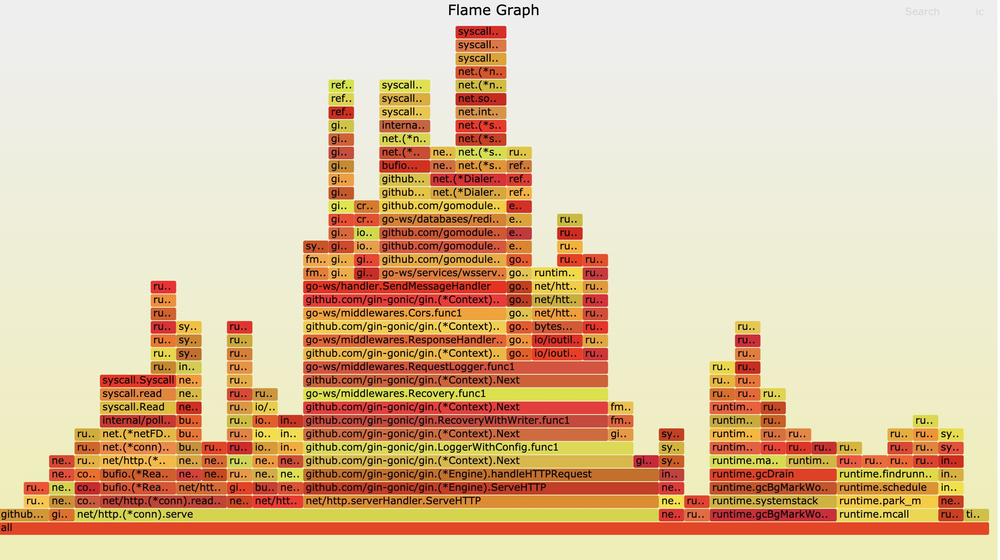

# go-ws
golang使用gin和redis实现分布式websocket通讯

##### wrk压测
Mac 安装
```cassandraql
brew install wrk
```
注意: mac 本身连接数有限制，不要做太大的测试

Linux 安装
```cassandraql
git clone https://github.com/wg/wrk.git
cd wrk
make
```
单机压测结果
CUP：2核 内存：4G
```cassandraql
wrk -t12 -c400 -d60s --script=sendMsg.lua --latency http://127.0.0.1:10186/ws/msg/send
Running 1m test @ http://127.0.0.1:10186/ws/msg/send
  12 threads and 400 connections
  Thread Stats   Avg      Stdev     Max   +/- Stdev
    Latency   230.82ms  441.09ms   1.99s    87.43%
    Req/Sec    33.63     45.48   650.00     89.59%
  Latency Distribution
     50%   10.98ms
     75%  229.20ms
     90%  778.82ms
     99%    1.90s
  2999 requests in 1.00m, 1.08MB read
  Socket errors: connect 0, read 0, write 0, timeout 493
Requests/sec:     49.90
Transfer/sec:     18.42KB
```
成功以后在目录下有一个 wrk 文件，将这个文件复制到你的软件目录，配置好环境变量

##### 基准测试
```
[root@master test]# go test -bench=Benchmark_Ws_SendMessage -benchmem -memprofile memprofile.out -cpuprofile profile.out -run=none
goos: linux
goarch: amd64
pkg: go-ws/test
Benchmark_Ws_SendMessage-2          1608          10356729 ns/op           11699 B/op         66 allocs/op
PASS
ok      go-ws/test      16.743s

```
查看cpu文件
```cassandraql
[root@master test]# go tool pprof profile.out
File: test.test
Type: cpu
Time: Jun 5, 2020 at 12:28am (CST)
Duration: 16.73s, Total samples = 410ms ( 2.45%)
Entering interactive mode (type "help" for commands, "o" for options)
(pprof) top
Showing nodes accounting for 280ms, 68.29% of 410ms total
Showing top 10 nodes out of 135
      flat  flat%   sum%        cum   cum%
     110ms 26.83% 26.83%      140ms 34.15%  syscall.Syscall
      80ms 19.51% 46.34%       80ms 19.51%  runtime.futex
      20ms  4.88% 51.22%       20ms  4.88%  encoding/json.(*encodeState).string
      10ms  2.44% 53.66%       10ms  2.44%  go.uber.org/zap/zapcore.(*jsonEncoder).AppendString
      10ms  2.44% 56.10%       10ms  2.44%  internal/poll.runtime_pollSetDeadline
      10ms  2.44% 58.54%       30ms  7.32%  net.(*conn).Read
      10ms  2.44% 60.98%       10ms  2.44%  runtime.SetFinalizer.func2
      10ms  2.44% 63.41%       10ms  2.44%  runtime.epollwait
      10ms  2.44% 65.85%       10ms  2.44%  runtime.exitsyscallfast
      10ms  2.44% 68.29%       10ms  2.44%  runtime.growslice
(pprof)                                                          
```
查看内存文件
```cassandraql
[root@master test]# go tool pprof memprofile.out
File: test.test
Type: alloc_space
Time: Jun 5, 2020 at 12:28am (CST)
Entering interactive mode (type "help" for commands, "o" for options)
(pprof) top
Showing nodes accounting for 14296.22kB, 90.30% of 15832.27kB total
Showing top 10 nodes out of 54
      flat  flat%   sum%        cum   cum%
 5138.05kB 32.45% 32.45%  5138.05kB 32.45%  bufio.NewWriterSize
 3084.01kB 19.48% 51.93%  3084.01kB 19.48%  bufio.NewReaderSize
 1195.29kB  7.55% 59.48%  2322.96kB 14.67%  compress/flate.(*compressor).init
 1184.27kB  7.48% 66.96%  1184.27kB  7.48%  runtime/pprof.StartCPUProfile
 1127.67kB  7.12% 74.08%  1127.67kB  7.12%  compress/flate.newDeflateFast
  516.01kB  3.26% 77.34%   516.01kB  3.26%  os.(*File).readdirnames
     514kB  3.25% 80.59%      514kB  3.25%  runtime/pprof.(*profileBuilder).locForPC
  512.75kB  3.24% 83.83%   512.75kB  3.24%  bytes.makeSlice
  512.08kB  3.23% 87.06%  9758.18kB 61.63%  github.com/gomodule/redigo/redis.Dial
  512.08kB  3.23% 90.30%   512.08kB  3.23%  go.uber.org/zap/zapcore.NewJSONEncoder
(pprof)                                                                              
```

下载Gin框架专用pprof包并在项目中添加
[https://github.com/gin-contrib/pprof](https://github.com/gin-contrib/pprof)
```cassandraql
go get https://github.com/gin-contrib/pprof
```
采集协程数据并持续20S
```cassandraql
go tool pprof http://localhost:10186/debug/pprof/goroutine?second=20
```

安装graphviz的方式如下：
```cassandraql
brew install graphviz # for macos

apt-get install graphviz # for ubuntu

yum install graphviz # for centos
```
火焰图[go-torch](https://github.com/uber-archive/go-torch)
```cassandraql
$ go get github.com/uber/go-torch
$ cd $GOPATH/src/github.com/uber/go-torch
$ git clone https://github.com/brendangregg/FlameGraph.git

$go-torch -u http://127.0.0.1:10186 -t 30
```
生成torch.svg


